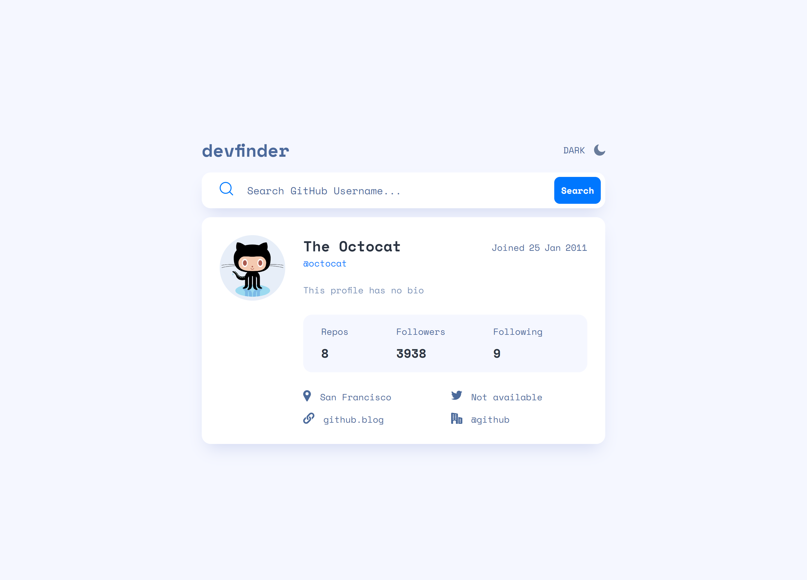
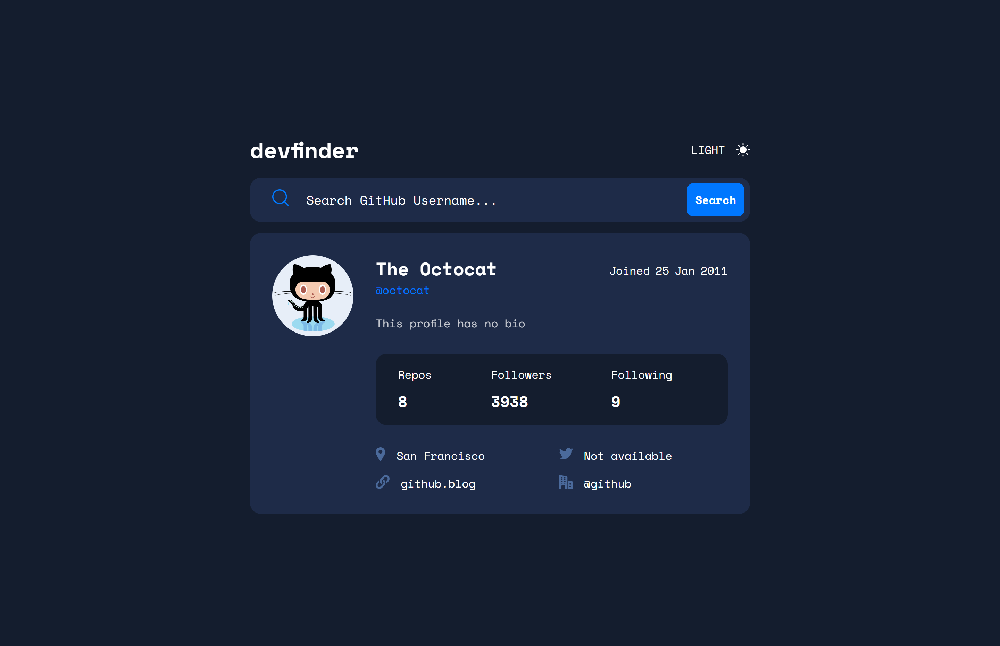
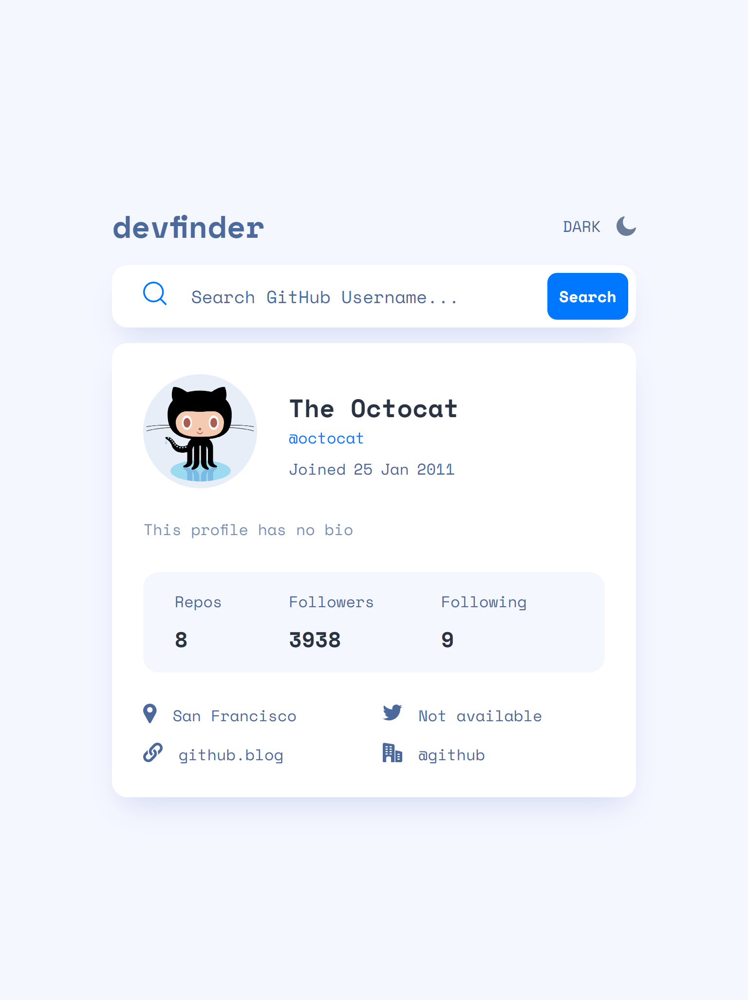
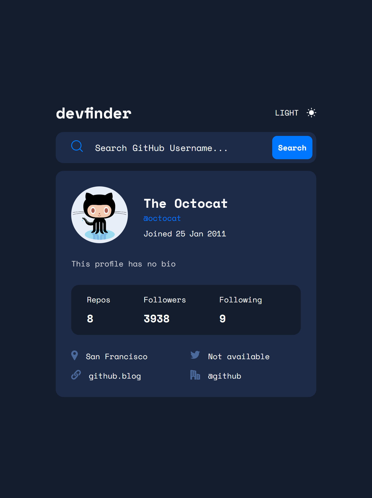
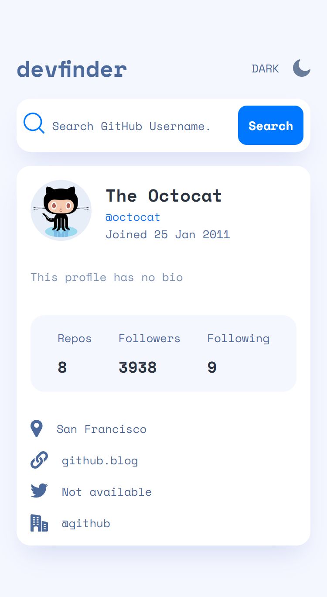
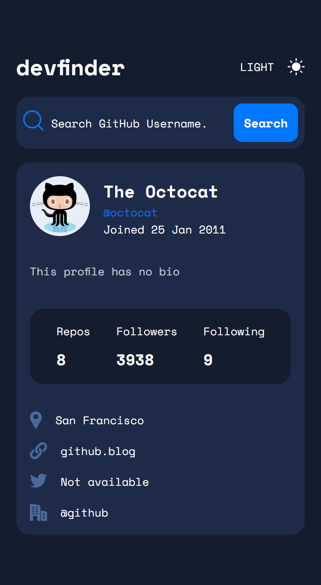

# GitHub user search app solution

This is a solution to the [GitHub user search app challenge on Frontend Mentor](https://www.frontendmentor.io/challenges/github-user-search-app-Q09YOgaH6). Frontend Mentor challenges help you improve your coding skills by building realistic projects. 

## Table of contents

- [Overview](#overview)
  - [The challenge](#the-challenge)
  - [Screenshot](#screenshot)
  - [Links](#links)
- [My process](#my-process)
  - [Built with](#built-with)
- [Author](#author)
- [Acknowledgment](#acknowledgment)

## Overview

### The challenge

Users should be able to:

- Search for GitHub users by their username
- See relevant user information based on their search
- Switch between light and dark themes
- See hover states for all interactive elements on the page
- View the optimal layout for the app depending on their device's screen size
- Have the correct color scheme chosen for them based on their computer preferences.

### Screenshot

- Desktop

- Tablet

- Mobile

### Links

- Solution URL: [Explore the GitHub Repository](https://github.com/Kunalshakya/GitHub-User-Search-App)
- Live Site URL: [ View the live website](https://kunalshakya.github.io/GitHub-User-Search-App/)

## My process

### Built with

- Semantic HTML5 markup
- CSS custom properties
- CSS Media Query
- Flexbox
- JavaScript

## Author

- GitHub - [@Kunalshakay](https://github.com/Kunalshakya)
- LinkedIn - [@kunal-shakya](https://www.linkedin.com/in/kunal-shakya-59323a259/)
- Frontend Mentor - [@Kunalshakya](https://www.frontendmentor.io/profile/Kunalshakya)

## Acknowledgments

I give credits to myself for being able to complete this project without asking for help and or looking for answers on the internet.
